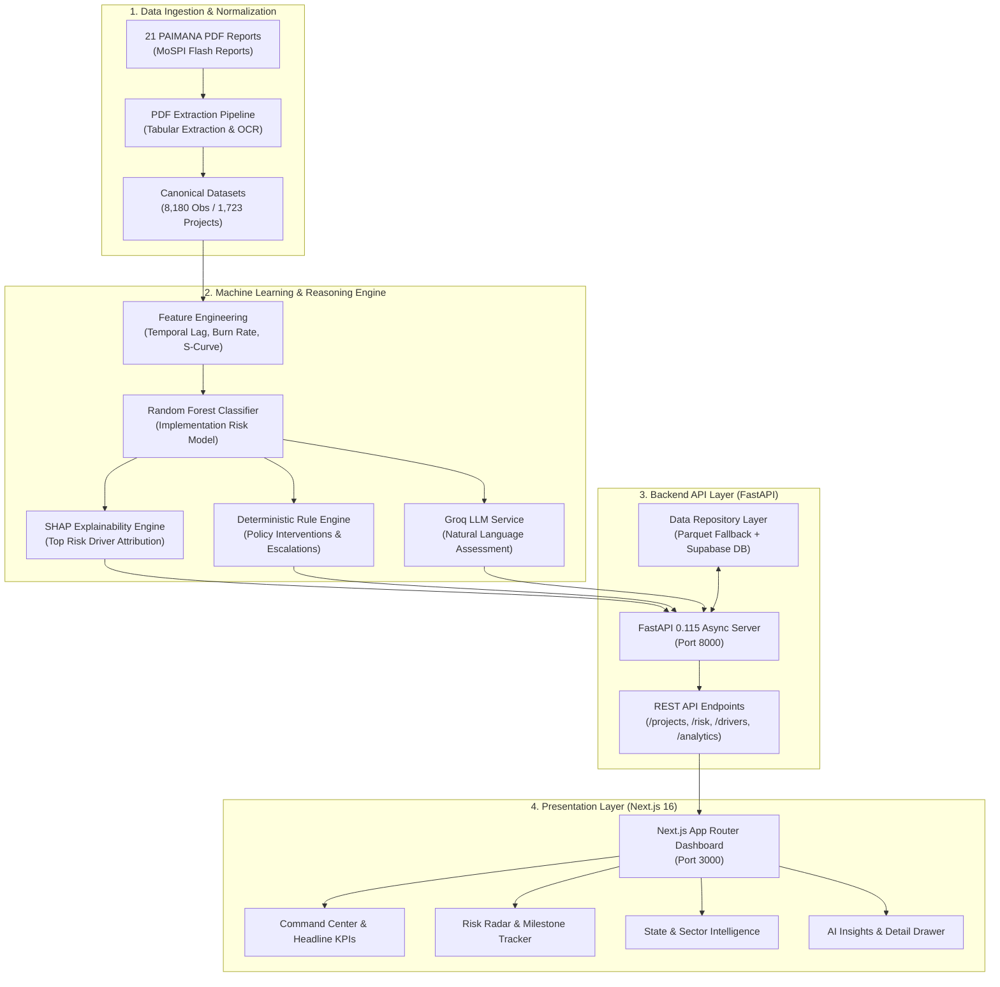

# NIRMAN AI

<div align="center">


<p><strong>National Infrastructure Risk Management & Analytics Network</strong></p>
<p><em>AI-Powered Early Warning Decision Support Platform for MoSPI / PAIMANA Infrastructure Projects</em></p>

</div>

---

## Executive Summary

NIRMAN AI is an enterprise-grade infrastructure intelligence and early-warning decision support platform built for the Ministry of Statistics and Programme Implementation (MoSPI). Designed for the Smart India Hackathon (SIH), the system monitors, analyzes, and predicts execution delays and cost overruns across mega central-sector infrastructure projects tracked under the PAIMANA framework.

The platform processes unstructured PDF flash reports, derives 8,180 canonical project-month observations across 1,723 national projects, trains temporally split machine-learning models, and delivers explainable risk scores alongside deterministic intervention guidance through an interactive Next.js dashboard.

---

## System Architecture

The following diagram illustrates the end-to-end data processing, model inference, and presentation layers of the NIRMAN AI ecosystem.



### Architectural Flow (Draw.io Functional Blueprint)

```
[ MoSPI PAIMANA PDFs ] 
          |
          v
[ Extraction Pipeline: PDF Parser + Entity Resolver + Validator ]
          |
          v
[ Parquet / Supabase Repository: 8,180 Canonical Observations ]
          |
          +------------------------+-------------------------+
          |                                                  |
          v                                                  v
[ Temporal ML Pipeline ]                           [ Analytics Aggregator ]
  * Feature Engineering                              * National Totals
  * Random Forest Risk Classifier                    * Sectoral Budgets
  * SHAP Driver Attribution                          * State Distribution
  * Heuristic Recommendation Engine                  * Outlier Detection
          |                                                  |
          +------------------------+-------------------------+
                                   |
                                   v
                    [ FastAPI Backend Service ]
                      * /api/v1/projects
                      * /api/v1/projects/{id}/risk
                      * /api/v1/projects/{id}/drivers
                      * /api/v1/projects/{id}/recommendations
                      * /api/v1/projects/{id}/assessment
                      * /api/v1/intelligence/states
                      * /api/v1/intelligence/sectors
                                   |
                                   v
               [ Next.js 16 Production Dashboard ]
                 * National Infrastructure Command Center
                 * Priority Risk Radar
                 * Side-by-side Project Drawer
                 * Multi-criteria Dynamic Filters
                 * Explainable AI Insights Modal
```

---

## Core Capabilities

- **Automated Report Normalization**: Ingests multi-table MoSPI PAIMANA monthly review documents, unifies disparate project identifiers, and constructs validated time-series panels.
- **Leakage-Safe Temporal ML**: Uses chronological training-validation splits to prevent future-data contamination, evaluating risk probabilities across real construction horizons.
- **Explainable Predictions (XAI)**: Attributes root causes using SHAP values (e.g., land acquisition lag, forest clearance blockages, physical-vs-financial expenditure variance).
- **Prescriptive Recommendations**: Pairs statistical risk rankings with standard operating procedure (SOP) recommendations tailored to nodal ministries.
- **Multi-Level Intelligence**: Aggregates macro capital outlays across 36 States/UTs and key infrastructure sectors (Roads, Railways, Power, Petroleum, Urban Development).

---

## Project Structure

```
SIH/
├── NIRMAN AI/
│   ├── .ai/                             # Antigravity context, specs, and architecture files
│   ├── backend/                         # FastAPI application and ML pipeline
│   │   ├── app/
│   │   │   ├── api/v1/                  # Versioned API routes (projects, risk, alerts, etc.)
│   │   │   ├── core/                    # Settings, config, error handlers, and logging
│   │   │   ├── data_ingestion/          # Supabase database seed scripts
│   │   │   ├── repositories/            # Data access layers (Parquet fallback + Supabase)
│   │   │   ├── schemas/                 # Pydantic data validation schemas
│   │   │   └── services/                # Assessment, LLM, and recommendation services
│   │   ├── extraction/                  # Multi-page PAIMANA PDF extraction engine
│   │   ├── ml/                          # Feature engineering, model training, and SHAP
│   │   │   └── saved_models/            # Serialized RandomForest model artifacts
│   │   ├── tests/                       # Complete pytest suite (31 unit & integration tests)
│   │   ├── .env.example                 # Backend environment variable template
│   │   ├── pytest.ini                   # Pytest configuration
│   │   └── requirements.txt             # Python dependencies
│   ├── nirman-ai-app/                   # Next.js 16 App Router frontend dashboard
│   │   ├── app/                         # App Router pages, layout, and components
│   │   │   ├── assistant-chat.tsx       # AI Assistant chat panel
│   │   │   ├── health-check.tsx         # Backend connectivity monitor
│   │   │   ├── layout.tsx               # Root application layout
│   │   │   └── page.tsx                 # Command center, risk radar, and intelligence views
│   │   ├── lib/api/                     # Typed API client and TypeScript definitions
│   │   ├── public/                      # Static assets and SVG icons
│   │   ├── package.json                 # Frontend dependencies and build scripts
│   │   └── tsconfig.json                # TypeScript compiler configuration
│   ├── data/
│   │   ├── curated/paimana/             # Canonical project-monthly datasets (CSV/Parquet)
│   │   ├── manifests/                   # Dataset profiles, audits, and validation records
│   │   ├── raw/                         # Raw PAIMANA PDF source documents
│   │   └── training/paimana/            # Feature catalogs, target specs, and model registries
│   ├── docs/                            # In-depth architectural and development documentation
│   ├── supabase/                        # Database migration schemas
│   ├── RUN_NIRMAN_AI.md                 # Complete operational run guide
│   ├── vercel.json                      # Vercel deployment specification
│   └── README.md                        # Master repository documentation
├── SIH Problem Statements.md            # Smart India Hackathon problem statement mapping
└── SIH theme based top PS.pdf           # SIH official theme reference document
```

---

## Key Metrics & Dataset Profile

| Metric | Value |
|---|---|
| Source Documents | 21 Official MoSPI Flash Reports |
| Monitored Projects | 1,723 Unique Infrastructure Projects |
| Monthly Observations | 8,180 Validated Project-Month Records |
| Reporting Periods | February 2025 - June 2026 |
| Machine Learning Model | Random Forest Implementation Risk Classifier |
| Backend Verification | 31 Passing Tests (0 Failures) |
| Frontend Performance | Static Compilation & Production Build Verified |

---

## API Specification

The FastAPI backend exposes versioned endpoints under `/api/v1`:

| Method | Endpoint | Description |
|---|---|---|
| GET | `/api/v1/health` | System health check and database status |
| GET | `/api/v1/projects` | Filterable list of monitored national projects |
| GET | `/api/v1/projects/{project_id}` | Detailed record for a specific project |
| GET | `/api/v1/projects/{project_id}/risk` | ML model risk classification and probability score |
| GET | `/api/v1/projects/{project_id}/drivers` | SHAP feature contribution ranking |
| GET | `/api/v1/projects/{project_id}/recommendations` | Prescriptive intervention recommendations |
| GET | `/api/v1/projects/{project_id}/assessment` | Unified assessment combining risk, SHAP, and recommendations |
| GET | `/api/v1/analytics/summary` | Macro KPIs (sanctioned budget, expenditure, at-risk count) |
| GET | `/api/v1/intelligence/states` | State-wise infrastructure allocation and delay profiles |
| GET | `/api/v1/intelligence/sectors` | Sector-wise risk distributions and expenditure velocity |

---

## Local Development & Setup

### Prerequisites

- Python 3.12 (`Python 3.12.14` recommended)
- Node.js (`v20.x` or `v24.x`)
- npm (`v10.x` or `v11.x`)

### Step 1: Backend Setup

```bash
cd "NIRMAN AI/backend"

# Create and activate virtual environment
python3.12 -m venv .venv312
source .venv312/bin/activate

# Install dependencies
pip install -r requirements.txt

# Run test suite to verify installation
python -m pytest tests/

# Launch backend server
python -m uvicorn app.main:app --host 127.0.0.1 --port 8000 --reload
```

The backend API will be available at:
- Base API: `http://127.0.0.1:8000`
- Interactive Swagger UI: `http://127.0.0.1:8000/docs`
- OpenAPI Specification: `http://127.0.0.1:8000/openapi.json`

### Step 2: Frontend Setup

Open a new terminal window:

```bash
cd "NIRMAN AI/nirman-ai-app"

# Install frontend dependencies
npm install

# Verify production build
npm run build

# Start development server
npm run dev
```

The dashboard will be available at:
- Web Dashboard: `http://localhost:3000`

---

## Sample Verified Test Projects

For evaluation and demonstration purposes, the following real projects can be inspected directly:

1. **N04000073 — VSI Airport Port Blair Terminal Building**
   - Sector: Civil Aviation
   - Location: Andaman & Nicobar Islands
   - Direct API Check: `curl http://127.0.0.1:8000/api/v1/projects/N04000073/risk`

2. **N04000077 — CCS Airport Lucknow New Integrated Terminal**
   - Sector: Civil Aviation
   - Location: Uttar Pradesh
   - Direct API Check: `curl http://127.0.0.1:8000/api/v1/projects/N04000077/assessment`

3. **N24000948 — Hunli-Anini Road Construction Project**
   - Sector: Road Transport and Highways
   - Location: Arunachal Pradesh
   - Direct API Check: `curl http://127.0.0.1:8000/api/v1/projects/N24000948/drivers`

---

## Technology Stack

- **Machine Learning & Analytics**: Scikit-Learn (Random Forest), SHAP (SHapley Additive exPlanations), Pandas, NumPy, PyArrow.
- **Backend Framework**: FastAPI 0.115, Pydantic v2, Uvicorn, Python 3.12.
- **Frontend Dashboard**: Next.js 16 (App Router), React 19, TypeScript, Vanilla Modular CSS.
- **Database & Storage**: PostgreSQL via Supabase, Parquet columnar storage, CSV fallback.
- **Quality Assurance**: Pytest 8.3, ESLint, TypeScript Compiler (`tsc`).

---

## License

Developed for the Smart India Hackathon (SIH). All rights reserved.
